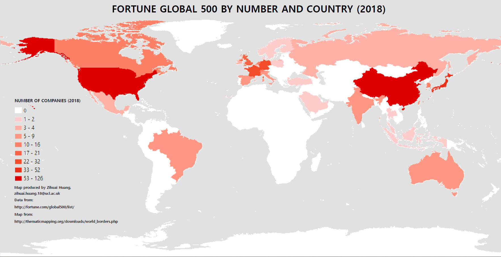
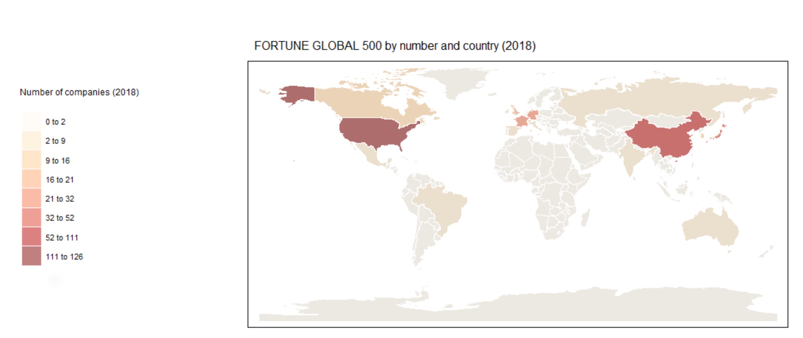

#MAPS




#CODE OF MAKING MAP BY USING R
```{r}
#Load useful package for map making
library(maptools)
library(RColorBrewer)
library(classInt)
library(OpenStreetMap)
library(sp)
library(rgeos)
library(tmap)
library(tmaptools)
library(sf)
library(rgdal)
library(geojsonio)
library(shinyjs)

#Load shapefile of the whole world
WorldMapSF <- read_shape("N:/CHA/GISS/wk4/CW/WorldProject/TM_WORLD_BORDERS-0.3/TM_WORLD_BORDERS-0.3.shp", as.sf = TRUE)
qtm(WorldMapSF)

#Load data of the FORTUNE GLOBAL 500 in 2018
MapData <- read.csv("N:/CHA/GISS/wk4/CW/WorldProject/cwp1/G.csv", header = TRUE, sep = ",")

#Help the data join the map
WorldDataMap <- append_data(WorldMapSF,MapData, key.shp = "FIPS", key.data = "FIPS", ignore.duplicates = TRUE， ignore.na = TRUE)

#Format the map and print it out
tmap_mode("plot")
qtm(WorldDataMap) + 
  tm_shape(WorldDataMap) + 
  tm_polygons("Number", 
              style = ("jenks"),
              palette="OrRd",
              n = 8,
              contrast = c(0, 1),
              border.col = "white",
              title="Number of companies (2018)",
              alpha = 0.5) + 
  tm_layout(main.title  = "FORTUNE GLOBAL 500 by number and country (2018)", main.title.position = "center", main.title.size = 1, legend.outside = TRUE, legend.outside.position = c("left", "bottom"))

```


#DISCUSSION

#Data Use
In this project, two map are made to show the Fortune global 500 (companies) by number and country in 2018. The data was collected directly from the official Fortune. However, there was not existed data of the Fortune 500 listed by the number of every country. Instead, there is only ranking data from 1 to 500. The data was styled manually into the data of number of companies in global 500 for every country. Further, the unique FIPS data is added to every country to connect the data to the map. 
map style choose,

#Map Style
In the both map, we choose to use different colors to distinguish the different numbers of Fortune global 500 companies in every country. This style helps reader to understand the map and distinguish the different amount of Fortune global 500 companies of every country more easily. Additionally, there is content at the left bottom corner to help reader to understand the meaning of each color.  

#Data Break
For the classification of the ArcMap, the Nature Breaks by Jenks is the choose. There are 9 classes in total. At first, it is 0, which means there is not any Fortune global 500 companies in this country. Then it is 1 – 2,  3 – 4, 5 – 9, 10 – 16, 17 – 21, 22 – 32, 33 – 52 and 53 – 126. The same break was used in R map. The difference is there is only 8 breaks in R map.

#Color
In map made by ArcMap, grey color was set as the background. The white and red colors are the main theme for the map. The white part in this map means there is not any Fortune global 500 company in this country. Furthermore, the darker red means the more Fortune global 500 companies in this country. At last, the title and reference are in black, which is easy to read and fits the style of the whole map. In map made by R, the color set 'OrRd' was used as the code showed. The border was set to white as the code showed as well. 

#R vs ArcMap
ArcMap is a wild used map software with easy-access UI designed. ArcMap is a map making software for everybody who wants to make a map. It had mature community for users' issues. However, it is hard to continue to work on others' map work with ArcMap. The layers and labels are confused for user that want to work on an finished map. On the other hand, R is welcomed for user to continue the work since the map is made by code only in R. User can easily understand every indexs or labels by reading the code. User can change the map by changing the code. R is high efficiency as well. It can generate maps faster than ArcMap did. However, making map with R is not as popular as ArcMap, which leads the leak of community support and the delay of updating. R is not welcomed for user without programming skill since it is code only map making.


